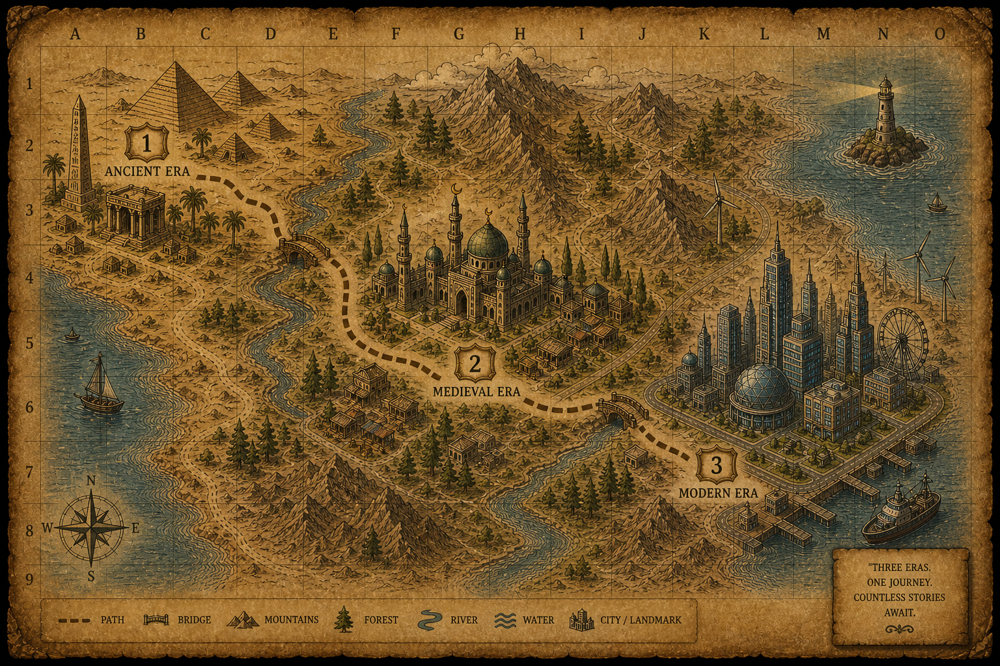
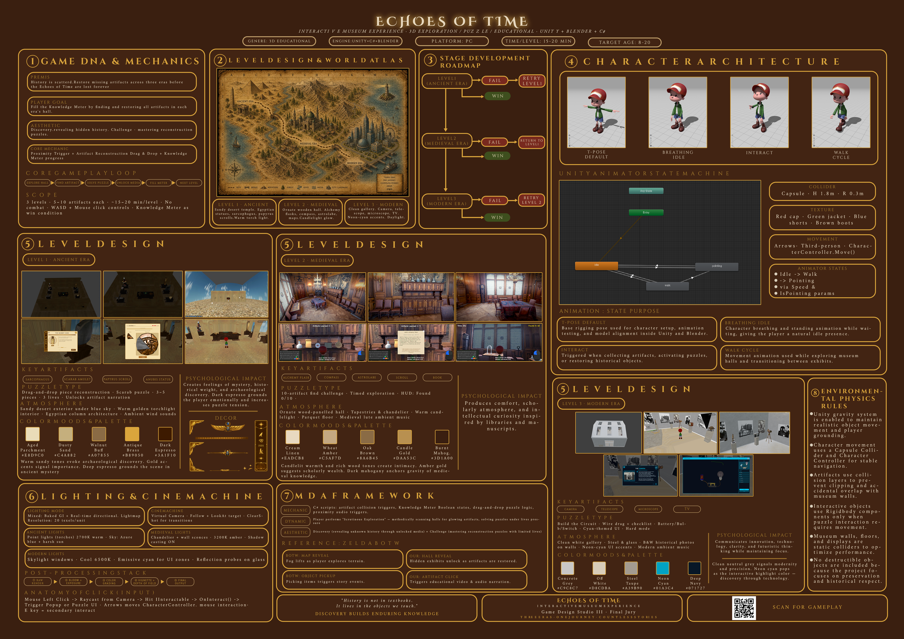

<div align="center">


<br/><br/>

```
███████╗ ██████╗██╗  ██╗ ██████╗ ███████╗███████╗     ██████╗ ███████╗
██╔════╝██╔════╝██║  ██║██╔═══██╗██╔════╝██╔════╝    ██╔═══██╗██╔════╝
█████╗  ██║     ███████║██║   ██║█████╗  ███████╗    ██║   ██║█████╗  
██╔══╝  ██║     ██╔══██║██║   ██║██╔══╝  ╚════██║    ██║   ██║██╔══╝  
███████╗╚██████╗██║  ██║╚██████╔╝███████╗███████║    ╚██████╔╝██║     
╚══════╝ ╚═════╝╚═╝  ╚═╝ ╚═════╝ ╚══════╝╚══════╝     ╚═════╝ ╚═╝    
                                                                        
████████╗██╗███╗   ███╗███████╗
╚══██╔══╝██║████╗ ████║██╔════╝
   ██║   ██║██╔████╔██║█████╗  
   ██║   ██║██║╚██╔╝██║██╔══╝  
   ██║   ██║██║ ╚═╝ ██║███████╗
   ╚═╝   ╚═╝╚═╝     ╚═╝╚══════╝
```

### *Interactive Museum Experience*

**A 3D educational game where history comes alive — restore lost artifacts, solve puzzles, and travel through time.**

<br/>

[](https://www.youtube.com/watch?v=aFLbpEu0VaM)

<br/>

</div>

---

## 📖 About the Game

**Echoes of Time** is a 3D educational puzzle game set inside a high-tech museum where historical artifacts have gone missing — threatening the *Echoes of Time*, the living continuity of history itself.

Players explore three distinct museum halls, each representing a major era of human civilization. To progress, they must **find displaced artifacts**, **solve era-themed puzzles**, and **restore the historical record** before it's lost forever.

> *"History isn't just what happened — it's what survives."*

---

## 🎮 Gameplay Overview

| | |
|---|---|
| **Genre** | 3D Exploration / Puzzle / Educational |
| **Platform** | PC · iOS · Android |
| **Age Rating** | 7+ |
| **Session Length** | ~15–20 minutes per level |
| **Engine** | Unity + Blender + C# |

### The Core Loop

```
[ Explore Hall ] ──► [ Find Artifact ] ──► [ Solve Puzzle ]
                                                   │
                           ◄────────────────────────
                           │
               [ Unlock Media ] ──► [ Fill Knowledge Meter ] ──► [ Next Level ]
```

---

## 🏛️ Levels

### 🏺 Level 1 — Ancient Hall *(Puzzle)*
> Torchlight flickers over warm stone walls. Egyptian statues stand incomplete, papyrus scrolls lie in pieces.

Drag and drop broken artifact fragments back together. Each reconstructed piece unlocks a voice-narrated story about Ancient Egyptian civilization.

---

### 🕌 Level 2 — Islamic Hall *(Missing Artifacts)*
> Arabesque patterns glow under warm lantern light. But something is missing — manuscripts, calligraphy tiles, and historic relics have been displaced.

Search the hall for every missing object and return it to its rightful place. A more open, exploration-focused challenge.

---

### ⚡ Level 3 — Modern Hall *(Electric Circuit)*
> Clean white walls, steel surfaces, neon accents. The centerpiece exhibit — a working electric circuit — has been scrambled.

Arrange and connect the circuit components in the correct configuration. The hardest challenge, requiring logical thinking to complete.

---

## ❤️ Lives System

The player starts each level with **3 hearts**.

- ❤️❤️❤️ — Full health
- A heart is lost each time a puzzle is **failed** or **answered incorrectly**
- Lose all 3 hearts → **restart the level**

No enemies. No combat. The only challenge is your mind.

---

## 🗺️ World Map

<div align="center">



*Follow the dashed path through three eras — Ancient → Islamic → Modern*

</div>

---

## 🗺️ Main Menu

The game opens with a main menu featuring four buttons:

| Button | Description |
|--------|-------------|
| **Welcome** | Atmospheric intro screen with game title |
| **Game Idea / Goal** | Overview of the story and learning objectives |
| **Developers** | Credits and team info |
| **Map** | Visual map of the three museum halls |

---

## 🕹️ Controls

| Input | Action | Levels |
|-------|--------|--------|
| `↑` `↓` `←` `→` | Move player | All |
| `E` | Interact / pick up / confirm | Level 1 & 3 |
| `Right Click` | Pick up and inspect artifacts | Level 2 |
| `ESC` | Pause / Menu | All |
| `Tab` | Open map | All |

---

## 🎯 MDA Framework

| Layer | Description |
|-------|-------------|
| **Mechanics** | C# collision detection, Knowledge Meter, hearts system, puzzle interaction |
| **Dynamics** | Scrutinous exploration — players search methodically and solve era-themed challenges |
| **Aesthetics** | **Discovery** (revealing unknown history) + **Challenge** (mastering puzzles) |

---

## 📽️ Demo Video

<div align="center">

[](https://www.youtube.com/watch?v=aFLbpEu0VaM)

</div>

---

## 🛠️ Tech Stack

```
├── Unity (Game Engine)
├── Blender (3D Modeling & Environments)  
├── C# (All game logic & interaction systems)
├── Unity Audio System (Narration, SFX, ambient loops)
└── Unity UI Toolkit (Knowledge Meter, Hearts, Overlays)
```

---

## 🚀 Getting Started

### Prerequisites
- Unity **2022.3 LTS** or later
- Blender **3.x** (for asset editing)
- Git LFS (for large 3D assets)

### Run Locally

```bash
# Clone the repository
git clone https://github.com/GehadMedhat/echoes-of-time.git

# Open in Unity Hub
# File > Open Project > select the cloned folder

# Press Play in the Unity Editor to run
```

---

## 📁 Project Structure

```
echoes-of-time/
├── Assets/
│   ├── Scenes/          # MainMenu, AncientHall, IslamicHall, ModernHall
│   ├── Scripts/         # C# game logic
│   │   ├── ArtifactController.cs
│   │   ├── KnowledgeMeter.cs
│   │   ├── HeartsSystem.cs
│   │   ├── PuzzleManager.cs
│   │   └── CircuitPuzzle.cs
│   ├── Models/          # Blender 3D assets (.fbx)
│   ├── Audio/           # Narration, music, SFX
│   └── UI/              # HUD, menus, overlays
├── Docs/
│   └── EchoesOfTime_GDD.pdf   # Full Game Design Document
└── README.md
```

---

## ✨ Features

- 🏛️ **3 unique museum halls** — Ancient, Islamic, Modern
- 🧩 **3 distinct puzzle types** — reconstruction, artifact search, electric circuit
- 📚 **Educational narration** — professional voice-over for every artifact
- ❤️ **Lives system** — stakes without combat
- 🗺️ **Interactive map** — fast-travel between discovered zones
- 🔊 **Era-authentic music** — Egyptian strings, Islamic oud/ney, Modern ambient
- 👤 **Narrator choice** — male/female, child/adult

---

## 🔮 Future Plans

- [ ] Multiplayer co-op (split-screen / online)
- [ ] AR mode — place artifacts in your real room
- [ ] Expanded artifact database with hundreds of real objects
- [ ] Adaptive lighting based on puzzle stress level
- [ ] New eras: Renaissance · Industrial Revolution · Space Age

---

## 🎨 Game Design Poster

<div align="center">



</div>

---

## 👥 Team

| Name | Role |
|------|------|
| **Gehad Medhat Ali** | Game Design · Development |
| **Amr Khaled Khedr** | Game Design · Development |
| **Aisha Ibrahim Mohamed** | Game Design · Development |

*Alexandria National University — Software Engineering, Class of 2026*

---

## 📄 License

This project was created as a university course project.  
© 2026 Gehad Medhat Ali, Amr Khaled Khedr, Aisha Ibrahim Mohamed. All rights reserved.

---

<div align="center">

*"Restore the artifacts. Restore the memory. Restore the Echoes of Time."*

⭐ **Star this repo** if you found it interesting!

</div>
